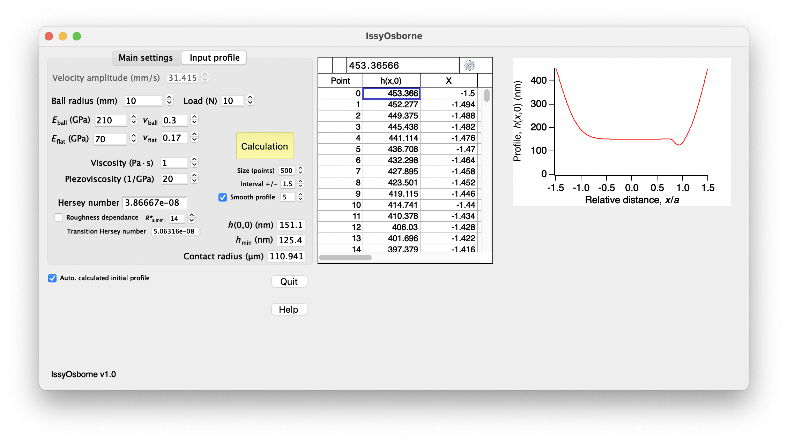
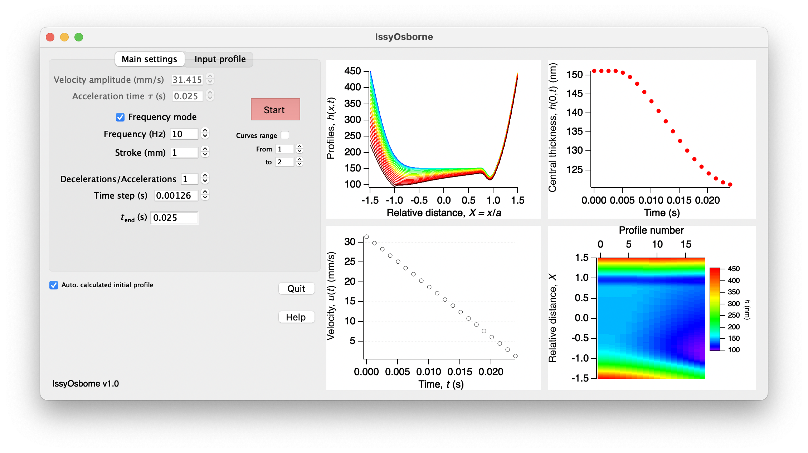

# IssyOsborne

IssyOsborne: 
trans**I**ent **S**queeze and **S**tarvation in elastoh**Y**drodynamic - **OS**cillating **B**odies s**O**lving **R**eynolds o**N**e-dimensional **E**quation  

This name is a tribute to the famous physicist [Osborne Reynolds](https://en.wikipedia.org/wiki/Osborne_Reynolds) pioneer in the understanding of fluid dynamics.

**Important:** This software requires Igor v8.0 to run.

## Installation
Clone the git repository and open the IssyOsborne.pxp in [Igor Pro](https://www.wavemetrics.com/products/igorpro)
(Use the demo version of Igor Pro to try IssyOsborne).

## Using IssyOsborne

1/ In the "Input profile" tab, set the ball radius, load, material moduli, fluid viscosity and piezoviscosity values.

2/  Input initial profile $h(x,0)$ (two methods):
- Method 1: Use the film thickness experimental data measured during a classical constant velocity test (horseshoe shape profile). The set velocity should correspond to the velocity amplitude of the periodical velocity set in the "Main settings" tab. Just past $(h, X)$ data in the table. Uncheck "Auto. calculated initial profile" box.

- Method 2: Press "Calculation button" and let IssyOsborne calculate an initial profile based on Crook's approximation, Moes-Venner equation of central film thickness $h(0,0)$ and a realistic smooth profile with an estimate of the minimum film thickness $h(x_m,0)$. 

_The number of points and smoothness characteristics of the profile can be adjusted using the inputs "Size", "Interval" and "Smooth profile"._
{ width=100% }

3/ In the "main settings tab":
- [x] Set the contact kinematics either by setting the velocity amplitude$^*$ and the acceleration/deceleration time or by setting the sliding frequency and the stroke (i.e., twice the displacement amplitude).
- [x] Set the desired number of the displayed decelerations/accelerations.
- [x] The time step (i.e., graph resolution) is automatically optimized. This parameter can be manually adjusted for a better graphical resolution implying a longer calculation time.
- [x] Press "Start button" to launch the algorithm and display the results.
- [x] _Optionally, the curve range can be adjusted to focus on some parts of deceleration or acceleration sequences._
- [x]  Check "Auto. calculated initial profile box" to automatically calculate the initial profile while changing "Main settings" parameters.
{ width=100% }

$^*$ _The algorithm uses a triangular velocity as first approximation of the sine kinematics._

## Results display

The "input profile" tab displays:
- The initial profile $h(X,0)$ associated to its data table $(h,X)$.
- The central film thickness $h(0,0)$.
- The minimum film thickness $h(X_m,0)$.
- The Hertzian contact radius.
- The dimensionless Hersey number calculated by the formula $N_{\mathrm{H}}=\frac{\eta_0\cdot f}{P}$ or $N_{\mathrm{H}}=\frac{\eta_0\cdot \dot X}{P\cdot R_\mathrm{a}}$ if the surfaces combined roughness $R^*_{\mathrm{a}}$ is specified.
- The transition Hersey number (that will be better explained in our next publication in 2023).

The "Main settings" tab displays:
- The velocity evolution $u(t)$.
- The colored profiles with time $h(X,t)$.
- The central profile evolution $h(0,t)$.
- The colored profile waterfall with film thickness $h(X,t)$.

## Code

The algorthmes and code (macros, functions and windows codes) are available in the src folder. This code is used in Igor Pro procedure file.

## Community Guidelines
Bug reports and requests for improvements, and new features are welcomed! Please feel free to make a post to [Issue Tracker](https://git.enit.fr/myahiaou/issy-osborne/-/issues) or contact Dr. Malik Yahiaoui, [malik.yahiaoui@enit.fr](mailto:malik.yahiaoui@enit.fr)

## License
GPLv3 or later
